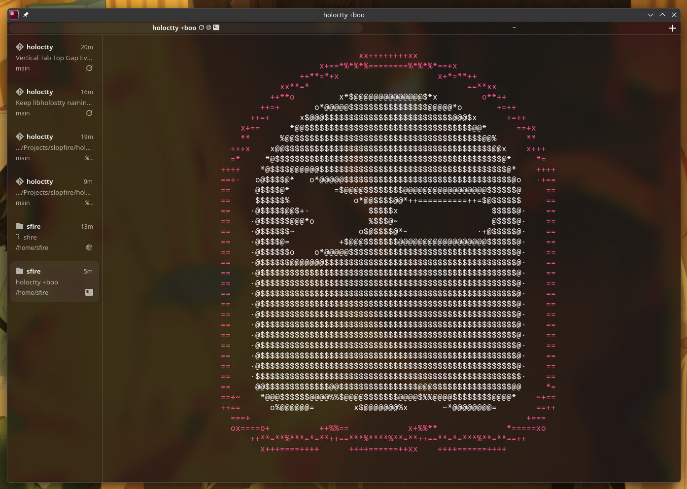

<!-- LOGO -->
<h1>
<p align="center">
  
  <br>Holoctty
</h1>
  <p align="center">
    A <a href="https://github.com/ghostty-org/ghostty">Ghostty</a> fork for Linux
    with vertical tabs, persistent sessions, and process-aware chrome.
    <br />
    Same terminal engine. Different GTK app.
    <br />
    <a href="#about">About</a>
    ·
    <a href="#changes-from-ghostty">Changes</a>
    ·
    <a href="#build-and-install">Install</a>
    ·
    <a href="#configuration">Configuration</a>
    ·
    <a href="https://ghostty.org/docs">Upstream docs</a>
    ·
    <a href="HACKING.md">Developing</a>
  </p>
</p>

<p align="center">
  
</p>

## About

Holoctty is a low-effort slopfork of [Ghostty](https://github.com/ghostty-org/ghostty)
focused on the Linux GTK application. It keeps Ghostty's terminal emulator,
renderer, and `libghostty` core, and changes the window chrome: tabs can
live in a resizable sidebar, related terminals are grouped into sessions,
and the sidebar and session bar show what is actually running.

PRs extending and fixing icon support are appreciated

The binary is `holoctty`. The GTK application id is `com.sfire.holoctty`
(debug builds use `com.sfire.holoctty-debug`). Configuration lives at
`~/.config/holoctty/config.holoctty`.

Everything that is not listed under [Changes from Ghostty](#changes-from-ghostty)
is inherited from upstream. Use the
[Ghostty documentation](https://ghostty.org/docs) for terminal sequences,
fonts, keybinds, shell integration, and the rest of the shared config.

## Changes from Ghostty

These are the fork-only changes on top of Ghostty. They apply to the GTK
(Linux / FreeBSD) app unless noted.

### Vertical tab sidebar

`gtk-tabs-location` accepts `left` and `right` in addition to Ghostty's
`top` and `bottom`. Vertical tabs are a resizable sidebar of cards, not
a rotated tab strip.

Each card shows:

- The foreground process name and a symbolic icon (agent, TUI, or shell)
- Working directory, with a git icon when the directory is inside a repo
- SSH host and a remote-server icon when the tab is a remote session
- How long the tab has been open

The sidebar width is remembered in XDG state (`~/.local/state/holoctty`)
and restored for new windows. Dragging snaps to device pixels so
fractional scaling does not leave a ragged edge. Tabs can be reordered
by dragging.

Vertical tabs force the `native` titlebar style, because Ghostty's
`tabs` titlebar only works with a horizontal tab bar.

### Persistent sessions

A session is a live group of tabs. Switching sessions keeps the other
groups running; closing or dragging a session moves every tab it owns.
Sessions can be dragged between windows the same way tabs can.

The compact session bar sits above the terminal. Each session shows a
truncated row of process icons from the tabs inside it, plus a number
or the active tab title. The bar appears automatically once there is
more than one session.

Sessions follow the selected tab's title, so the session bar and the
window title stay in sync with the current terminal.

### Tab groups

Tab groups are colored chips that cluster contiguous tabs inside one
session's vertical sidebar. They are only meaningful with
`gtk-tabs-location = left` or `right`, where the group header renders
above its members.

- Right-click a vertical tab and choose **Add Tab to New Group** to
  create a group around that tab.
- When other groups exist, right-click a tab and choose
  **Add to \<name\>** to put it in an existing group.
- **New Tab Group…** in the window menu, **New Tab Group** in the GTK
  command palette, or the `new_tab_group` action (default
  `ctrl+shift+g`) groups the current tab and opens the name dialog.
- The header chip label is the custom name, or the color name when the
  group is unnamed (`Grey`, `Blue`, `Red`, `Yellow`, `Green`, `Pink`,
  `Purple`, `Cyan`).
- Click the header title to collapse or expand the group. Collapsed
  members use compact cards that hide the meta and footer rows.
- The header **+** opens a new tab in that group.
- Right-click the header for **Name this group…**, **New Tab in
  Group**, the color swatches, **Ungroup**, and **Close group**.
- Drag the header to reorder groups, or drag it off the window to tear
  the whole group into a new window.
- Drag a tab onto a header to add it to that group. Inserting a tab
  between two members of the same group joins that group.
- Right-click a grouped tab and choose **Remove From Group**.
- Tab groups are not sessions. Closing a session still closes every
  tab it owns, including grouped ones.

### Process icons

Vertical tabs and the session bar share one process detector
(`src/apprt/gtk/cli_process.zig`). It walks the foreground process tree,
unwraps SSH (`holoctty +ssh`), versioned Python, `uv`, `pipx`, and
common npm / share install paths, and only treats a shell as idle when
it is not running a command.

Recognized processes include:

| Kind | Examples |
| --- | --- |
| Agents | Codex, Claude, Gemini, OpenCode (including `opencode2`), Grok, Cursor, Copilot, Amp, Pi, OMP, Devin, Aider, Goose, Crush, Cline, Droid, Kilo, Kimi, Qwen, Auggie, Hermes, Plandex, OpenHands, Continue, Amazon Q |
| TUIs | Neovim, Vim, Helix, Lazygit, GitUI, Tig, Lazydocker, Docker, btop, Kubernetes tools, Yazi, Ranger, Superfile, Glow |
| Shells | Bash, Zsh, Fish, Nushell, PowerShell |
| Remote | SSH and other remote clients |

Idle shells do not occupy session-bar slots. TUI and shell icons can be
hidden independently.

### Chrome that follows the terminal

`window-padding-color = extend-full` paints the session bar and vertical
tab sidebar with the live terminal background:

- A full-screen TUI fill (for example Grok, OSC 11, or a painted
  viewport) is copied onto the chrome
- Partial fills such as diff rows and large interior highlights are
  ignored so they do not tint the chrome or drop it back to the
  translucent config background
- Processes listed in `window-padding-extend-full-ignore` stay on the
  default surface background (useful for TUIs such as OMP that paint
  enough cells to look full-screen but do not look good on chrome)
- A default or transparent surface uses the same background color and
  `background-opacity` as the GL terminal
- Switching tabs or sessions updates chrome to the focused surface

This overrides `gtk-vertical-tab-opacity`. Separators and the wide
`GtkPaned` handle use the same chrome color so a translucent window does
not punch a bright line through the sidebar.

### Branding and packaging

Ghostty names are replaced in the Linux app, not in `libghostty`:

- Binary and resources: `holoctty`
- Desktop / D-Bus / Flatpak / Snap id: `com.sfire.holoctty`
- Config, state, and crash directories: `holoctty`
- App icon is the red ghost used in this repo

`holoctty +boo` is the upstream Ghostty easter egg, recolored to match
the icon.

### New configuration

All of these are GTK-only. Defaults match Ghostty's horizontal tabs
until you opt in.

| Key | Values | Default | What it does |
| --- | --- | --- | --- |
| `gtk-tabs-location` | `top`, `bottom`, `left`, `right` | `top` | `left` / `right` enable the vertical sidebar |
| `gtk-session-bar` | `auto`, `always`, `never` | `auto` | When the compact session bar is shown |
| `gtk-session-label` | `number`, `title` | `number` | Session label; the other value stays on the tooltip |
| `gtk-session-tui-icons` | `true`, `false` | `true` | Neovim, Lazygit, btop, and other TUI icons in the session bar |
| `gtk-session-shell-icons` | `true`, `false` | `true` | Idle-shell icons in the session bar |
| `gtk-vertical-tab-opacity` | `0`–`1` | `0.08` | Sidebar background opacity; ignored with `extend-full` |
| `window-padding-color` | Ghostty values plus `extend-full` | `background` | `extend-full` extends the live TUI into GTK chrome |
| `window-padding-extend-full-ignore` | `[omp,codex]` or a name | unset | Skip chrome fill for those TUIs |

Example that matches the screenshot:

```
gtk-tabs-location = left
window-padding-color = extend-full
window-padding-extend-full-ignore = [omp,codex]
```

### New actions and keybinds

| Action | Default | Notes |
| --- | --- | --- |
| `goto_session:N` | `ctrl+shift+1` … `ctrl+shift+9` | Selects session N; missing sessions are created up to N |
| `new_session` | none | Command palette **New Session**, or bind it |
| `close_session` | none | Closes the session and every tab it contains |
| `new_tab_group` | `ctrl+shift+g` | Groups the current tab and opens the name dialog |

`new_session`, `close_session`, and sessions 1–9 are also in the GTK
command palette. **New Tab Group** is also in the GTK command palette
and the window menu.

## Build and install

Holoctty is built from this tree. There is no separate download channel
from Ghostty's.

Requires [Zig](https://ziglang.org) **0.16.0** (see
`minimum_zig_version` in `build.zig.zon`). Linux builds also need GTK4,
libadwaita, and, from a Git checkout, `blueprint-compiler` 0.16.0 or
newer. See [HACKING.md](HACKING.md) for the full developer setup.

User install to `~/.local`:

```sh
./install.sh
```

System install to `/usr` (stages as you, copies with `sudo`):

```sh
./install.sh --system
```

`install.sh` builds `-Doptimize=ReleaseFast`, installs the binary,
desktop file, icons, terminfo, and shell integration, then refreshes
the desktop and icon caches. Extra `zig build` flags go after `--`:

```sh
./install.sh -- -Dgtk-x11=false
```

Or build by hand:

```sh
zig build -Doptimize=ReleaseFast
# binary: zig-out/bin/holoctty
```

## Configuration

Create `~/.config/holoctty/config.holoctty`. Most keys are the same as
Ghostty's (`font-family`, `theme`, `keybind`, `background-opacity`,
…). Fork-only keys are listed above.

Reload with the same action as Ghostty (`reload_config`; default
`ctrl+shift+,` on Linux).

## Documentation

- Shared terminal behavior, config reference, and install notes:
  [ghostty.org/docs](https://ghostty.org/docs)
- Building and hacking this tree: [HACKING.md](HACKING.md)
- Packaging: [PACKAGING.md](PACKAGING.md)

Treat Ghostty docs as the source of truth for the emulator. If a GTK
UI detail disagrees with this README, this README wins.

## Contributing and developing

This is a personal Ghostty fork. Do not open Holoctty pull requests
against [ghostty-org/ghostty](https://github.com/ghostty-org/ghostty),
and do not expect Ghostty maintainers to take these GTK chrome changes
as-is.

If you are working in this tree, read [HACKING.md](HACKING.md) and
[UPSTREAM.md](UPSTREAM.md). Linux GUI checks should use isolated virtual
KWin (`virt-shot`), not a window on the live desktop.

Upstream Ghostty still has its own contributing process, AI policy, and
vouch system. Those apply to Ghostty, not automatically to this fork.

## Crash reports

Holoctty keeps Ghostty's built-in crash reporter. Reports are written
to `$XDG_STATE_HOME/holoctty/crash` (default `~/.local/state/holoctty/crash`)
the next time the app starts after a crash. They are **not** sent
anywhere unless you upload them.

```sh
holoctty +crash-report
```

Reports use the [Sentry envelope format](https://develop.sentry.dev/sdk/envelopes/)
and can contain stack memory, so treat them as sensitive.

## License

MIT. Holoctty is a fork of Ghostty. Original authorship and copyright
remain with Mitchell Hashimoto and the Ghostty contributors; see
[LICENSE](LICENSE).
